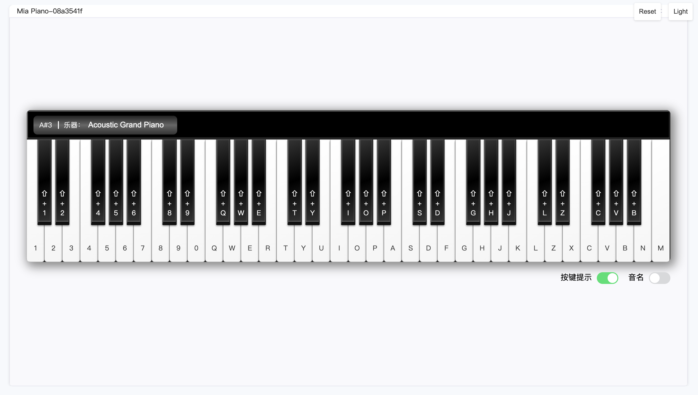
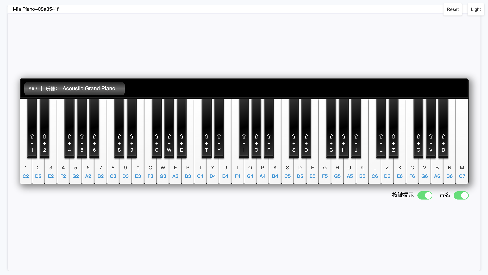
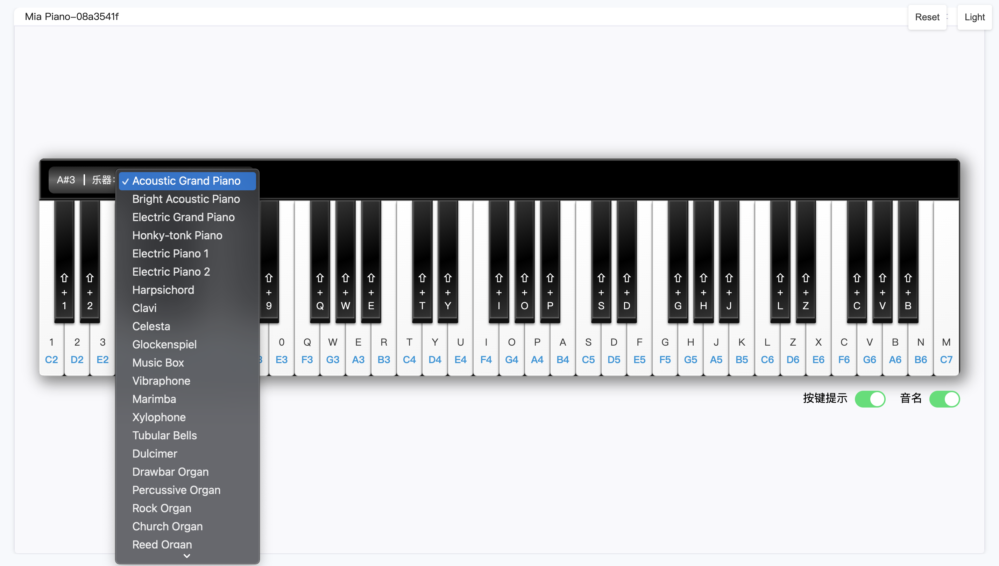

## Mia Piano

Mia Piano 是一个给钢琴老师用来线上教学的插件。我们的愿景是，为钢琴老师教授初学者时提供一个比较好的教授及练习平台。

提供了：
* 键盘按键弹奏、鼠标点击弹奏
* 支持大量乐器切换
* 支持音名提示/按键提示

## 预览

  
  

## 优化方向

- 实现自动演奏，为教学场景提供更加生动且可视化的平台。
- 内置常用MIDI谱子
- 支持外接设备（MIDI键盘编曲）